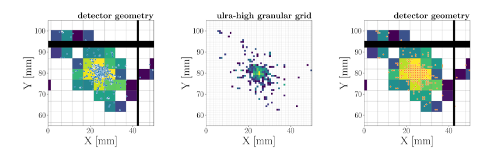
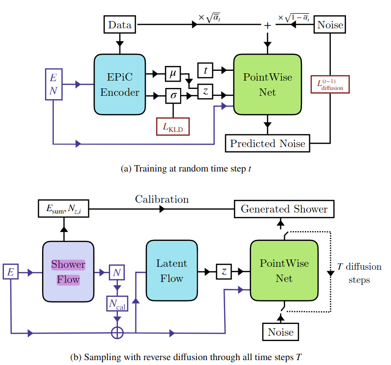

# CaloClouds

## Dataset

15GB (60GB after decompression)
* <https://zenodo.org/records/10044175/files/CaloCloudsData.tar.xz?download=1>
* <https://syncandshare.desy.de/index.php/s/XfDwx33ryERwPdi>

## Bayesian model

Let $s: shower$ be the shower we want to model and $E: incident energy$ the desired model input. Then we aim to learn $p(s|E)$.

$$
p(s|E) = \int_z \int _{N} p(s|z,E,N)p(N|E)p(z|E,N)\ dNdz
$$

where 
* **PointWise Net** learns $p(s|z,E,N)$
* **Shower Flow** learns $p(N|E)$
* **Latent Flow** learns $p(z|E,N)$

**Speculation**

To learn $p(s|z,E,N)$ we analyze 

$$
p(s|z,E,N)p(z|E,N) = p(z|s,E,N) p(s|z.E,N)
$$

# CaloClouds 2

# CaloClouds 3