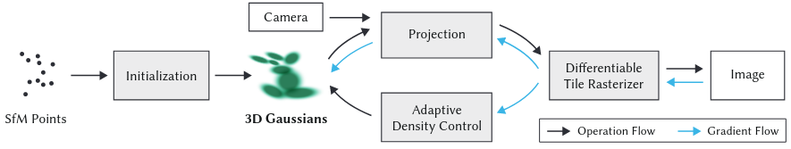
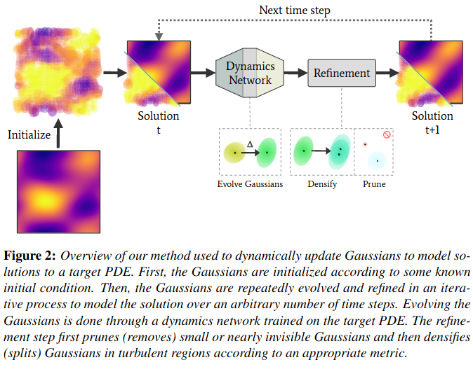

# Gaussian Splats

Point-based rendering with an implicit 3D Gaussian modeling of the scene.

* Requires only unstrctured, sparse SfM pointcloud, no Multi-View Stereo method required.
* No neural networks.
* Gaussians as a representation of Radiance Fields. Continuous space modeling, avoiding  inexistent discontinuities (e.g. holes). Doensn't require interpolation before rasterization.
* Easily recover from {under/over}reconstructed regions. This has only been treated with neural networks in the past.
* Avoids modeling empty space.



```
1. Randomly initialize Gaussians.
2. Project Gaussians to image plane for current camera matrix.
3. Rasterize.
4. Compute loss.
5. Optimize Gaussian parameters. Densify/Prune the set of Gaussians. Go to 2.
```

## METHOD

### Input

Set of images

We assume the scene is static and we have a set of images from different viewpoints $\{i=1,\dots,N:\ \mathcal{N}_i(\pmb \mu_i,\ \Sigma_i) \}$ 

### SfM

From the set of given images we extract a sparse 3D pointcloud (SfM). 3DGS requires only this pointcloud as input, nothing extra (like MVS).

### 3D Gaussians

The volume is the modeled as a mixture of 3D Gaussians. Each Gaussian models the density of light that's absorbed by that  of the volume. 

### Rasterization

Assume a set of 3D Gaussians $\{i=1,\dots,N:\ \mathcal{N}_i(\pmb \mu_i,\ \Sigma_i) \}$  
projected onto the image plane by
$$\pmb \mu' = P V \pmb \mu,\quad \Sigma' = (J V) \Sigma (JV)^T$$

$\pmb \mu$: 3d mean of a Gaussian \
$\Sigma$: 3d variance matrix of a Gaussian \
$V$: camera matrix \
$P$: raster projection \
$J$: Jacobian of V \
$\pmb \mu'$: projected 2d mean of a Gaussian \
$\Sigma'$: projected 2d variance matrix of a Gaussian

Then, the color of pixel $x$ is a function of the corresponding transmittance of light onto $x$, which has not been absorbed by volume in the scene.

$$
\hat C(\pmb x) = \sum_{i=1}^N c_i \alpha_i(\pmb x) \prod_{j=1}^{i-1} (1-\alpha_j(\pmb x))
$$
where
$$
\alpha_i(\pmb x) = \sigma_i exp\Big(-\dfrac{1}{2}(\pmb x - \pmb \mu_i')^T \Sigma_i' (\pmb x - \pmb \mu_i')\Big)
$$

$i$: index from nearest-to-farthest Gaussian relative to the camera's position\\
$\pmb x$: pixel coordinates \\
$c_i$: color of Gaussian \\
$\sigma_i$: opacity of Gaussian \\

## OPTIMIZATION

$$
\mathcal{L} = \| \hat C(\pmb x) - C(\pmb x) \|_2^2
$$

**TRAINING:**

***

