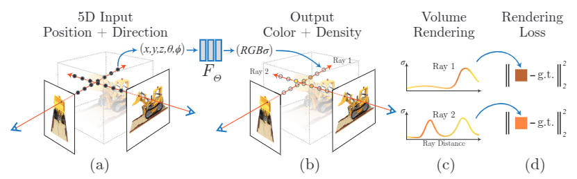

# Neural Rediance Fields

## NeRFs

Represent a 3D scene using Radiance Fields. Given enough images of the same scene, the model outputs new images of the same scene from different viewpoints.

### Model

Radiance Fields model the volume of the scene using rays $\pmb{r}(t)$ starting from the POV traversing the image plane and the scene $[t_n,t_f]$. For each ray, the color of the pixel that it goes through is modeled as an integral function of the volume density of that ray.

$$
C(\pmb{r}(t)) = \int_{t_n}^{t_f} \exp\Big(- \int_{t_n}^{t} \sigma(\pmb{r}(s))~ds \Big)~\sigma(\pmb{r}(t))~\pmb{c}(\pmb{r}(t),\pmb{d})~dt
$$

The integral is approximated by sampling points along each ray.

### Training

**INPUT**: 3D point coordinates + camera viewing direction $d$

**OUTPUT**: 2D RGB image

**LOSS**:
$$
\mathcal{L} = \sum_{\pmb{r}} \| \hat C (\pmb r) - C (\pmb r) \|_2^2
$$

<!-- 
$$
T(\pmb{r}(t)) = \exp\Big(- \int_{t_n}^{t} \sigma(\pmb{r}(s))~ds \Big)
$$
-->

### Concept

#### Volume density for multi-view

For the same scene two non-parallel rays - ray1, ray2 - from two seperate views meet at some point within the scene. Consequently, with Radiance Field modeling, two views contain overlapping volumetric information. 
In fact, each point corresponds to multiple rays of separate views, which is why it's possible to estimate a novel ray without

Mildenhall, B., Srinivasan, P. P., Tancik, M., Barron, J. T., Ramamoorthi, R., & Ng, R. (2021). Nerf: Representing scenes as neural radiance fields for view synthesis. Communications of the ACM, 65(1), 99-106.

## Physics Augmented Continuum NERFs

PAC-NeRFs model moving objects in a static scene using 
a dynamical radiance field, without using geometric priors.
Faster rendering than NERFS using Eulerian representation.
Cameras are static wrt the scene and static objects/background are removed.
 (Minivan for 4 passengers plus 7 luggage) while the total cost amounts to 450 euros by choosing one of the follow payment methods
### Model

Dynamics of the radiance field (same as **Optical Flow** dynamics):
$$
\dfrac{D\sigma}{Dt} = 0 \Rightarrow \dfrac{\partial \sigma}{\partial t} = - \pmb v^T \nabla \sigma
$$
$$
\dfrac{D\pmb c}{Dt} = 0 \Rightarrow \dfrac{\partial \pmb c}{\partial t} = - \pmb v^t\nabla \pmb c
$$
meaning that for a given ray, change of the volume density over time is directional.
Velocity $\pmb v$ evolves according to
$$
\rho \dfrac{D \pmb v}{Dt} = \nabla \pmb T + \rho \pmb g
$$

$\rho$: physical density of the moving object (suppose uniform), \
$\pmb T$: stretch matrix \
$\pmb g$: gravity acceleration \
are given constants.

### Training

INPUT: 3D point in scene + camera direction wrt scene center $d$ \
OUPUT: RGB image \
LOSS:
$$
\mathcal{L} = \sum_{\pmb{i}} \sum_{\pmb{r}} \| \hat C (\pmb r,t_i) - C (\pmb r,t_i) \|_2^2 \quad (+ Physics?)
$$
$C(\cdot,t)$ as per in NERFs with an additional input, time $t$. 

### Refs

Li, X., Qiao, Y. L., Chen, P. Y., Jatavallabhula, K. M., Lin, M., Jiang, C., & Gan, C. (2023). Pac-nerf: Physics augmented continuum neural radiance fields for geometry-agnostic system identification. arXiv preprint arXiv:2303.05512. \
Code: https://github.com/xuan-li/PAC-NeRF

## Flow-NeRF

Flow-NeRFs models a moving scene using dynamic Radiance field and (linear) Scene Flow.
